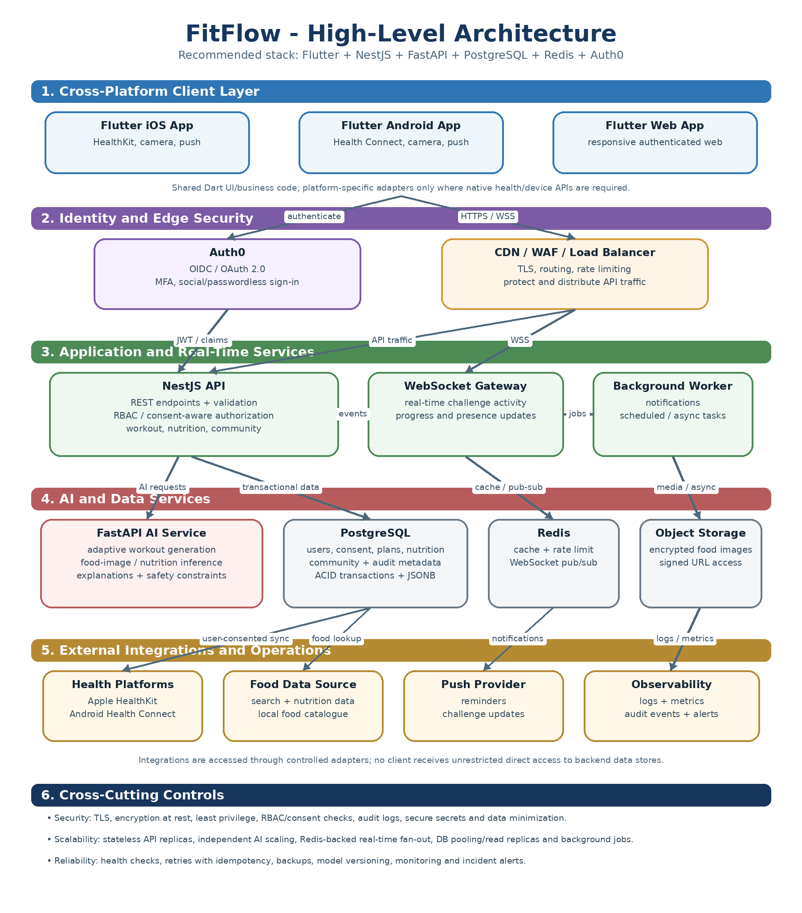
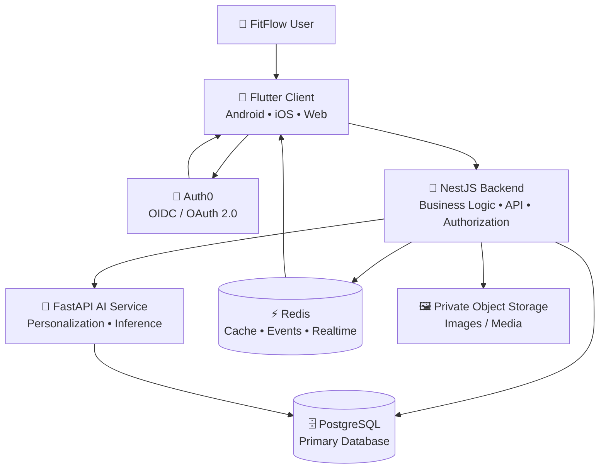

<div align="center">

# 🏋️ FitFlow Redesign

### ✨ Human-Centered Fitness • Intelligent Personalization • Privacy by Design


<br>

[](#)
[](#)
[](#)
[](#)

<br>

[](https://flutter.dev/)
[](https://nestjs.com/)
[](https://fastapi.tiangolo.com/)
[](https://www.postgresql.org/)
[](https://redis.io/)
[](https://github.com/features/actions)

<br>

**Prepared for:** IT3060 – Human Computer Interaction  
**Programme:** BSc (Hons) in Information Technology – Year 3, Semester 2  
**Academic Year:** 2026  

**Student:** Liyanage L.D  
**Student ID:** IT23658318  

<br>

> 🚀 **FitFlow Redesign** is a technology-selection and high-level architecture project that transforms the HCI findings from Labs 01–04 into a technically feasible, scalable and privacy-conscious implementation direction for the FitFlow fitness application.

</div>

---

## 📌 Table of Contents

- [🌟 Project Overview](#-project-overview)
- [🎯 Project Goals](#-project-goals)
- [🧠 HCI Design Context](#-hci-design-context)
- [🏆 Selected Technology Stack](#-selected-technology-stack)
- [💡 Why This Stack?](#-why-this-stack)
- [📊 Technology Decision Summary](#-technology-decision-summary)
- [🏗️ High-Level Architecture](#️-high-level-architecture)
- [🔄 Core Data Flows](#-core-data-flows)
- [🔐 Security and Privacy](#-security-and-privacy)
- [📁 Repository Structure](#-repository-structure)
- [🚀 Getting Started](#-getting-started)
- [🧪 CI/CD](#-cicd)
- [🌿 Branch Protection](#-branch-protection)
- [📚 Documentation](#-documentation)
- [🧭 HCI Traceability](#-hci-traceability)
- [⚠️ Scope and Limitations](#️-scope-and-limitations)
- [👨‍🎓 Author](#-author)

---

# 🌟 Project Overview

**FitFlow** is a fitness application focused on:

- 🏋️ Workout planning and tracking
- 🤖 AI-assisted personalized workout plans
- 🥗 Faster nutrition tracking
- 📈 Clearer progress visualization
- 👥 Private social challenges
- 🔐 Privacy and consent controls
- 🎯 Long-term motivation and engagement

The redesign is based on the user-centered design work completed during **IT3060 Human Computer Interaction Labs 01–04**.

Lab 05 moves the project from **HCI research and interface evaluation** toward a **technology and architecture decision**.

The goal is not simply to choose popular technologies.

The selected stack must support the actual FitFlow requirements identified through previous HCI activities.

---

# 🎯 Project Goals

The FitFlow technology architecture is designed to achieve the following goals:

| 🎯 Goal | 💬 Description |
|---|---|
| 📱 Cross-platform experience | Provide a consistent experience across iOS, Android and web |
| ⚡ Performance | Keep frequent fitness tasks fast and responsive |
| 🔄 Code reuse | Reduce duplicated development work across platforms |
| 🤖 AI readiness | Support personalized and explainable workout recommendations |
| 🥗 Efficient tracking | Reduce friction in nutrition and workout logging |
| 👥 Real-time interaction | Support private social challenges and updates |
| 🔐 Privacy | Protect activity, nutrition and personal fitness information |
| 📈 Scalability | Support future growth without major architectural redesign |
| 🛠️ Maintainability | Keep the system manageable for a mid-sized development team |
| 💰 Cost awareness | Avoid unnecessary infrastructure complexity and operational cost |

---

# 🧠 HCI Design Context

The technology architecture continues the findings and design decisions created during the earlier FitFlow HCI labs.

### 🔎 Important user needs

FitFlow users require:

- 🧭 Clear and understandable navigation
- ⏱️ Low-effort repeated interactions
- 🤖 Personalized workout recommendations
- 💬 Explanations for AI-generated plans
- ✏️ Ability to edit, regenerate or reject AI recommendations
- 🥗 Faster nutrition entry
- 📊 Clear progress feedback
- 👥 Private social interaction
- 🛡️ Strong privacy controls
- ♿ Accessible and understandable interfaces

### 🧪 Lab 04 priorities

The usability evaluation highlighted several areas requiring particular attention:

| Area | Design implication |
|---|---|
| 🔐 Social privacy | Visibility must be obvious before users join or share |
| 🥗 Nutrition portions | Portion units and quantities need clearer interaction |
| 🤖 AI explanations | Recommendations require understandable reasoning |
| ✏️ AI editing | Users need clear control over generated plans |
| 🧭 Navigation | Labels and selected states should improve discoverability |
| 📊 Progress | Information should remain readable and easy to scan |

These HCI findings influenced the Lab 05 technology choices.

---

# 🏆 Selected Technology Stack

<div align="center">

| Layer | Selected Technology | Primary Role |
|---|---|---|
| 📱 **Frontend** | **Flutter / Dart** | Cross-platform user interface |
| 🧩 **Main Backend** | **NestJS / TypeScript** | API, business logic and authorization |
| 🤖 **AI Service** | **FastAPI / Python** | AI/ML inference and personalization |
| 🗄️ **Database** | **PostgreSQL** | Transactional application data |
| ⚡ **Cache / Real-time** | **Redis** | Caching, events and real-time fan-out |
| 🔑 **Authentication** | **Auth0** | Identity, OIDC/OAuth 2.0 and MFA support |
| 🖼️ **Media Storage** | **Private encrypted object storage** | Images and uploaded media |
| 🔁 **CI/CD** | **GitHub Actions** | Automated repository verification |

</div>

---

# 💡 Why This Stack?

## 📱 Flutter

Flutter was selected as the main frontend technology because FitFlow requires a strong experience across:

- Android
- iOS
- Web

### ✅ Advantages

- High code reuse
- Strong mobile performance
- Consistent UI system
- Fast interface development
- Mature ecosystem
- Suitable for animation-rich fitness interfaces
- Good support for REST APIs and WebSockets

### ⚠️ Consideration

Web output may not always behave like a traditional DOM-first web application, so platform-specific optimization may still be required.

---

## 🧩 NestJS

NestJS acts as the main application backend.

### ✅ Responsibilities

- REST API endpoints
- User authorization
- Workout operations
- Nutrition operations
- Social challenge logic
- Privacy enforcement
- Database communication
- AI-service orchestration
- Real-time event coordination

Its TypeScript-based modular architecture provides a structured backend suitable for a mid-sized team.

---

## 🤖 FastAPI

AI functionality is separated into a Python-based FastAPI microservice.

### ✅ Why separate AI?

Python provides a strong ecosystem for:

- Machine learning
- Data processing
- Recommendation systems
- Model inference
- Future AI experimentation

Separating AI functionality prevents the primary application backend from becoming tightly coupled to model implementation.

---

## 🗄️ PostgreSQL

PostgreSQL is used as the primary system-of-record database.

It is suitable for structured relationships such as:

- 👤 Users
- 🏋️ Workouts
- 📋 Workout plans
- 🍎 Nutrition records
- 👥 Challenges
- 🔐 Permissions
- 📊 Progress records
- 📝 Audit information

### ✅ Key advantages

- Strong relational modelling
- ACID transactions
- Complex querying
- Mature indexing
- Reliable authorization-related data handling
- Strong ecosystem support

---

## ⚡ Redis

Redis supports temporary and high-speed data operations.

Potential responsibilities include:

- Caching
- Session-related temporary data
- Event distribution
- Rate limiting
- Real-time challenge updates
- WebSocket fan-out

Redis does **not** replace PostgreSQL as the primary data store.

---

## 🔐 Auth0

Auth0 provides identity and authentication services.

The application architecture can use:

- OIDC
- OAuth 2.0
- MFA where appropriate
- Token-based authentication
- Role/permission integration

Authentication does not replace server-side authorization.

Every sensitive FitFlow operation must still be authorized by the backend.

---

# 📊 Technology Decision Summary

The technologies were evaluated using FitFlow-specific criteria rather than popularity alone.

### 🧮 Main decision criteria

| Criterion | Importance |
|---|---|
| ⚡ Performance | High |
| 🔐 Security | High |
| 📈 Scalability | High |
| 🧑‍💻 Development speed | High |
| 🔄 Code reusability | High |
| 🤖 AI/ML support | High |
| 🛠️ Maintainability | High |
| 💰 Cost | Medium–High |
| 🌐 Web compatibility | High |
| 🔴 Real-time support | Medium–High |

Detailed comparisons and weighted scoring are available here:

📊 **[Technology Comparison Matrix](docs/comparison-matrix.md)**

📱 **[Frontend Comparison](docs/frontend-comparison.md)**

🧩 **[Backend, Database & Authentication Comparison](docs/backend-database-auth-comparison.md)**

📚 **[Technology Stack Summary](docs/tech-stack-summary.md)**

---

# 🏗️ High-Level Architecture

<div align="center">



</div>

The architecture separates responsibilities to improve maintainability, security and scalability.

### 🧱 Main architecture layers



> 💡 The Mermaid diagram provides a quick conceptual view.  
> The official architecture image is stored in `docs/architecture/`.

---

# 🔄 Core Data Flows

## 🏋️ 1. Personalized Workout Plan

```text
User
  ↓
Flutter Client
  ↓
NestJS API
  ↓
FastAPI AI Service
  ↓
PostgreSQL / Required User Context
  ↓
Generated Workout Recommendation
  ↓
NestJS Validation
  ↓
Flutter UI
```

The response should provide:

- 🧠 Relevant recommendation factors
- ⚠️ Safety information where necessary
- ✏️ Edit controls
- 🔄 Regenerate option
- ⏸️ Pause option
- ❌ Reject option

This supports **explainable and reversible AI interaction**.

---

## 👥 2. Private Social Challenge

```text
Flutter
   ↓
NestJS
   ↓
Authorization + Consent Check
   ↓
PostgreSQL
   ↓
Redis / Real-time Event
   ↓
Approved Challenge Participants
```

### 🔐 Privacy rule

A user must not gain access to another user's private fitness information simply because both users participate in a challenge.

Visibility must remain controlled by explicit permissions.

---

## 🥗 3. Nutrition Tracking

```text
Flutter
  ↓
Camera / Search Input
  ↓
NestJS
  ↓
Food Data or FastAPI Inference
  ↓
User Confirms Food + Portion
  ↓
PostgreSQL
```

Media files can be stored separately using:

- 🔒 Private buckets
- 🔑 Short-lived signed URLs
- 🧹 Appropriate retention controls

---

# 🔐 Security and Privacy

FitFlow may process personal fitness, activity and nutrition-related information.

Security therefore forms part of the architecture rather than being treated as a final add-on.

## 🛡️ Security Principles

| Principle | Implementation Direction |
|---|---|
| 🔒 Encryption in transit | TLS |
| 🗄️ Encryption at rest | Database/storage encryption |
| 🔑 Authentication | OIDC / OAuth 2.0 |
| 🧱 Authorization | Server-side checks |
| 👤 Least privilege | Minimum required permissions |
| ✅ Consent | Explicit sensitive-data sharing decisions |
| 🔁 Revocation | Users can remove previously granted access |
| 📝 Auditability | Important security events can be logged |
| 🚫 Log safety | Avoid sensitive health/identity data in ordinary logs |
| ⏳ Temporary media access | Short-lived signed URLs |
| 📦 Data minimization | Collect only required information |

---

## ⚠️ Compliance Note

> **No framework, cloud service, database or authentication provider is automatically HIPAA/GDPR compliant by itself.**

Compliance readiness depends on factors such as:

- Deployment configuration
- Eligible service plans
- Contracts and agreements
- Access policies
- Consent processes
- Data retention
- Incident response
- Governance
- Operational procedures

The FitFlow architecture therefore treats HIPAA/GDPR as **system-wide responsibilities**.

---

# 📁 Repository Structure

```text
fitflow-redesign/
│
├── 📱 frontend/
│   ├── lib/
│   │   └── main.dart
│   ├── pubspec.yaml
│   └── README.md
│
├── 🧩 backend/
│   ├── src/
│   │   ├── main.ts
│   │   └── app.module.ts
│   ├── package.json
│   ├── tsconfig.json
│   └── README.md
│
├── 🤖 ai-service/
│   ├── app/
│   │   └── main.py
│   ├── requirements.txt
│   └── README.md
│
├── 📚 docs/
│   │
│   ├── architecture/
│   │   ├── fitflow-high-level-architecture.png
│   │   └── fitflow-architecture.dot
│   │
│   ├── adr/
│   │   └── ADR-001-technology-stack.md
│   │
│   ├── frontend-comparison.md
│   ├── backend-database-auth-comparison.md
│   ├── comparison-matrix.md
│   ├── tech-stack-summary.md
│   ├── github-setup.md
│   │
│   └── lab-report/
│       └── IT23658318_Lab_05_Completed.docx
│
├── ⚙️ .github/
│   └── workflows/
│       └── ci.yml
│
├── .env.example
├── .gitignore
└── README.md
```

---

# 🚀 Getting Started

> ℹ️ The repository currently contains **Lab 05 starter scaffolds and architecture documentation**.  
> It represents the selected implementation direction rather than a finished production application.

---

## 📱 Flutter Frontend

Navigate to the frontend directory:

```bash
cd frontend
```

Install Flutter dependencies:

```bash
flutter pub get
```

Run the application when the implementation environment is ready:

```bash
flutter run
```

---

## 🧩 NestJS Backend

Navigate to the backend:

```bash
cd backend
```

Install dependencies:

```bash
npm install
```

The backend scaffold can then be expanded with modules for:

- Authentication integration
- Users
- Workout plans
- Progress
- Nutrition
- Social challenges
- Privacy controls
- AI-service communication

---

## 🤖 FastAPI AI Service

Navigate to the AI service:

```bash
cd ai-service
```

Create a Python virtual environment:

```bash
python -m venv .venv
```

Activate it and install requirements:

```bash
pip install -r requirements.txt
```

The AI service can later host:

- Workout personalization
- Recommendation inference
- Nutrition-related inference
- Explainability metadata
- Model-version information

---

## 🔧 Environment Configuration

Use:

```text
.env.example
```

as the reference for environment variables.

🚨 **Never commit real secrets or `.env` credentials to the repository.**

---

# 🧪 CI/CD

GitHub Actions is configured through:

```text
.github/workflows/ci.yml
```

The current workflow verifies the presence of the essential Lab 05 repository artifacts and starter scaffolds.

### ✅ CI verifies

- README
- Frontend comparison
- Backend/database/auth comparison
- Technology matrix
- ADR
- Architecture diagram
- Flutter starter
- NestJS starter
- FastAPI starter
- `.env.example`
- Absence of a committed `.env` file

<div align="center">

[](https://github.com/LithiraLiyanage/fitflow-redesign/actions/workflows/ci.yml)

</div>

### 🔮 Future CI expansion

As implementation grows, CI can additionally run:

```text
Flutter analysis + tests
        ↓
NestJS lint + tests
        ↓
Python lint + tests
        ↓
Security checks
        ↓
Build validation
        ↓
Deployment pipeline
```

---

# 🌿 Branch Protection

The default branch is:

```text
main
```

The repository currently uses branch protection/rules to protect the main development history.

### 🛡️ Protected behavior

- ✅ Deletion protection
- ✅ Force-push protection
- ✅ GitHub Actions validation available

For a larger team workflow, additional rules can be introduced:

- Pull requests before merge
- At least one reviewer approval
- Required passing checks
- Code-owner review
- Conversation resolution

---

# 📚 Documentation

<details>
<summary><b>📱 Frontend Technology Comparison</b></summary>

<br>

Comparison of:

- Flutter
- React Native
- Kotlin Multiplatform
- Swift / SwiftUI

Includes performance, code reuse, web compatibility, ecosystem, learning curve, AI/ML integration, maintenance, cost and security considerations.

➡️ [`docs/frontend-comparison.md`](docs/frontend-comparison.md)

</details>

<details>
<summary><b>🧩 Backend, Database & Authentication Comparison</b></summary>

<br>

Includes comparison of backend, database and authentication options considered for FitFlow.

➡️ [`docs/backend-database-auth-comparison.md`](docs/backend-database-auth-comparison.md)

</details>

<details>
<summary><b>📊 Weighted Decision Matrix</b></summary>

<br>

Contains weighted technology scoring based on FitFlow project priorities.

➡️ [`docs/comparison-matrix.md`](docs/comparison-matrix.md)

</details>

<details>
<summary><b>🏗️ Architecture Decision Record</b></summary>

<br>

Documents the selected architecture, its context, alternatives and consequences.

➡️ [`docs/adr/ADR-001-technology-stack.md`](docs/adr/ADR-001-technology-stack.md)

</details>

<details>
<summary><b>📚 Technology Stack Summary</b></summary>

<br>

A compact explanation of the final selected stack.

➡️ [`docs/tech-stack-summary.md`](docs/tech-stack-summary.md)

</details>

<details>
<summary><b>🖼️ Architecture Diagram</b></summary>

<br>

➡️ [`docs/architecture/fitflow-high-level-architecture.png`](docs/architecture/fitflow-high-level-architecture.png)

</details>

---

# 🧭 HCI Traceability

The technical architecture supports requirements derived from the earlier human-centered design process.

| HCI Need | Technical Support |
|---|---|
| 🤖 Adaptive workout plans | FastAPI AI service + NestJS orchestration |
| 💡 Explainable recommendations | Explanation metadata returned with AI output |
| ✏️ User control | Editable/regeneratable plan workflow |
| 🥗 Faster food logging | Search/camera flow + AI-assisted processing |
| 📊 Progress visibility | Structured PostgreSQL data + Flutter visualization |
| 👥 Private challenges | Backend authorization + PostgreSQL + Redis events |
| 🔐 Privacy controls | Server-side access rules and explicit consent |
| ⚡ Low interaction latency | Redis caching + efficient APIs |
| 🌐 Cross-platform access | Flutter |
| 🛠️ Maintainability | Modular NestJS backend + isolated AI service |

---

# 🧠 Architectural Principles

The project follows several important principles:

### 1️⃣ Human-centered technology selection

Technology is selected to support user needs rather than forcing users to adapt to technical limitations.

### 2️⃣ Privacy by design

Privacy decisions are considered in:

- Authentication
- Authorization
- Data storage
- Social sharing
- Logging
- Media access

### 3️⃣ Explainable AI

AI recommendations should provide enough information for users to understand why a plan was suggested.

### 4️⃣ Human control

AI-generated plans should remain:

- Editable
- Reversible
- Rejectable
- Regeneratable

### 5️⃣ Separation of concerns

Flutter, NestJS, FastAPI, PostgreSQL and Redis each have clearly defined responsibilities.

### 6️⃣ Progressive scalability

The architecture can grow without requiring unnecessary complexity during early development.

---

# ⚠️ Scope and Limitations

This repository represents the **Lab Exercise 05 technology-selection and high-level architecture stage**.

It currently focuses on:

- ✅ Technology evaluation
- ✅ Weighted decision making
- ✅ Architecture design
- ✅ Security considerations
- ✅ AI integration planning
- ✅ Repository organization
- ✅ CI artifact verification

It should **not** be interpreted as:

- ❌ A finished production application
- ❌ A deployed healthcare platform
- ❌ A clinically validated AI system
- ❌ Proof of HIPAA or GDPR compliance
- ❌ A fully trained production AI model

Future implementation and testing would be required before production deployment.

---

# 🗺️ Future Development Direction


---

# 📌 Lab 05 Completion Checklist

| Requirement | Status |
|---|---|
| 📱 Frontend technology comparison | ✅ Complete |
| 🧩 Backend comparison | ✅ Complete |
| 🗄️ Database comparison | ✅ Complete |
| 🔑 Authentication comparison | ✅ Complete |
| 📊 Weighted decision matrix | ✅ Complete |
| 🏆 Recommended technology stack | ✅ Complete |
| 🏗️ High-level architecture | ✅ Complete |
| 📝 Architecture Decision Record | ✅ Complete |
| 📁 GitHub repository | ✅ Complete |
| 📚 README documentation | ✅ Complete |
| ⚙️ Initial project structure | ✅ Complete |
| 🤖 AI-service scaffold | ✅ Complete |
| 🔁 GitHub Actions workflow | ✅ Complete |
| 🛡️ Main-branch protection | ✅ Complete |

---

# 👨‍🎓 Author

<div align="center">

### 👤 Liyanage L.D

**Student ID:** `IT23658318`

**Module:** `IT3060 – Human Computer Interaction`

**Programme:** `BSc (Hons) in Information Technology`

**Year:** `Year 3 – Semester 2`

**Academic Year:** `2026`

<br>

[](https://github.com/LithiraLiyanage/fitflow-redesign)

<br>

### 💚 Designed with Human-Centered Computing in Mind

**Research → Design → Test → Decide → Architect → Build**

</div>

---

<div align="center">

### ⭐ FitFlow Redesign

*Better fitness technology begins with understanding the people who use it.*

<br>


</div>
